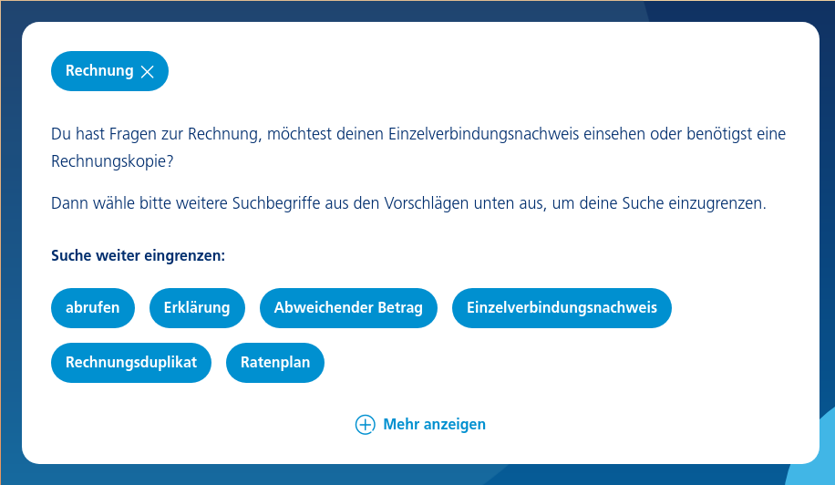
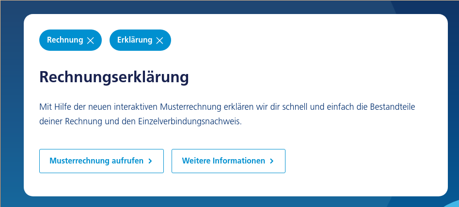

# Python Coding Challenge


**Please read all instructions before beginning to implement a solution as later specifications could affect earlier design choices.**

You have been asked to implement a service funnel for one of your customers. Their specifications are as follows:

*The end goal is to have a website where visitors can click on tags/topics and combine several of these to receive detailed information. The typical user will land on the page without knowing precisely what they are looking for. To guide this visitor we will show a list of predefined tags which are most frequently searched/visited. The visitors will click on the first tag they see as related to their problem and then choose ever more fine-grained tags until they reaches their final topic/piece of information theyr are searching for.*

Here are some screenshots to show this behaviour, initially we start with an empty list of selected tags. As the visitors clicks on more tags their answer becomes ever more specific.





Your task is to build an API which will power this functionality. Unfortunately the content of this service funnel is located externally. For security reasons you have not been given access to this external source but instead only receive a static HTML document which contains all the required data. 

These are the main tasks which need to be addressed:

1) Scraping HTML content
2) Implementing API functionality

## Scraping HTML

The HTML contains many elements. The ones relevant for you are the ones which contain the attribute `data-tags`. There can be multiple different elements containing this attribute. This attribute is a comma separated list of all `tags` relevant to this piece of information. The entire HTML element is what we are concerned about and will return in our API. We shall refer to each html element containing these `data-tags` as a `snippet`. You can assume that each combination of `data-tags` is unique throughout the HTML file.

Here an example snippet:
```
<article class="article " id="id-39334" data-tags="Widerruf, Mobilfunkvertrag,
Lastschriftverfahren, My Handy, Prepaid"> <h2>Ich möchte den Bankeinzug
widerrufen. Wie mache ich das?</h2> <div class="body-text"> <p>Bitte senden Sie
ein formloses Schreiben mit Angabe der Kunden-/Mobilfunknummer, für die Sie die
Einzugsermächtigung widerrufen möchten, und der Unterschrift des
Vertragsinhabers an:</p><p>Telefónica Germany GmbH &#38; Co.
OHG<br/>Kundenbetreuung<br/>90345 Nürnberg</p></div> <div class="sections">
<a href="https://prev.blau.de/service/rechnung/" class="btn btn-invert-beta
hidden" title="Weitere Informationen" data-tracking-action="textlink"
data-tracking-description="cms__cms/meta/service-content-pool/snippet-uebersicht/overview/view_Weitere
Informationen">Weitere Informationen</a>
</div> </article>
```

Your goal is to implement the method `def scrape_html(self, html: str):` which takes as input the entire html document as a string and stores it in an appropriate data structure.

Which data structure you choose will depend on the next part, implementing the API.

## Implementing API functionality

The API works as follows:
You send it a list of selected tags and you receive one of 3 types of responses seen below:
1. The given list of selected tags points to a unique snippet
2. The given list of selected tags is valid i.e. it is a subset of a list of
   tags which belong to a snippet
3. The given list of selected tags is invalid, this tag combination exists
   nowhere in the scraped HTML nor is it a subset thereof.

### API Response:

* status - An object with two fields 
    * code - 0,1,2 depending on which case you are in 
    * msg - explaining the meaning of the code 
* snippet - If one exists a HTML element as json serializable string, else null 
* next_tags - A list of valid tags which the visitor can click on next sorted
    alphabetically by the name field.
* selected_tags - A field to verify your API used the correct query parameters


### Example Requests

Request:
```
{"selected_tags": [{"name": "Kündigung"}, {"name": "Mobilfunkvertrag"}]}
```

Response: If the tag combination exists and has a snippet
```
{
"snippet": "<article> You're welcome </article>", 
"next_tags": [
{"name": "Beantragen"},
{"name": "Bestätigung"}
],
"status" : {"code" : 0, "msg": "Valid tags with snippet"},
"selected_tags": [{"name": "Kündigen"}, {"name": "Mobilfunkvertrag"}]
}
```

Response: If the user needs to select more tags to see a snippet
```
{
"snippet": null, 
"next_tags": [{"name": "Final Tag"}],
"status" : {"code" : 1, "msg": "Valid tags but no snippet"},
"selected_tags": [
{"name": "Not"},
{"name": "Enough"},
{"name": "Tags"}]
}
```

Response: Invalid combo of tags - user needs to go back by removing one or more tags

```
{
"snippet": null, 
"next_tags": [],
"status" : {"code" : 2, "msg": "Invalid tags"},
"selected_tags": [
{"name": "Some"},
{"name": "Invalid"},
{"name": "Combo"}]
}
```
 
### Detailed explanation of logic

Suppose the HTML contains the following snippets and tags mapping:
```
“S1” with tags “A”

“S2” with tags “A” “B” “C”

“S3” with tags “A” “B” “D”

“S4” with tags “A” “D” “E”
```

Please make sure your API should satisfy the following use cases. It would be also nice if you write unit tests for these use cases.
1. Given a set of snippets with a set of tags, any subset of these tags is a valid tag combination.
```
"A" "B" is a valid tag set as it is a subset of the tags for "S2" and "S3".
"B" "E" is not a valid tag set as it not a subset of any of the above snippets.
"X" is not a valid tag as it is not present in any of the above snippets.
```
2. Only valid possible tags are shown in the list of next_tags field. 
```
If "B" is selected only "A" "C" "D" are shown as next tags.
If "A" is selected "B" "C" "D" "E" are possible next tags.
```
3. A snippet is only output if the selected tags are an exact match to the tags on the HTML snippet.
```
If "A" is selected, "S1" should be shown.
If "A" "B" "C" is selected snippet "S2" should be shown.
If "A" "B" is selected no snippet should be shown because there's not unique snippet possible in this case.
```
4. A snippet can also be output if there is only one possible snippet which can be reached from the selected tag combination. 
```
If "E" is selected snippet "S4" should be shown. There's no exact match happening in this case and since there's only one 
possibility we can do fast-forward and assume that the selected tags consisted of "A" "D" "E" instead of just "E". 
There's also no need to show "A" "D" as next_tags in this case.
```
5. The order of the path taken to get to any snippet is irrelevant.
```
Selecting "C" "B" "A" is the same as selecting "A" "C" "B"
```
# SUPER IMPORTANT INSTRUCTIONS

1) To make your code testable please implement the method `def scrape_html(self, html: str):` which takes as input the entire html document as a string and stores it in an appropriate data structure. Don't do any changes in the `run_test.sh` file.
2) To make your code testable please implement the method `def handle_request(self, request: dict) -> dict:` which returns a response dict as shown above in the example responses.
3) Make sure that you don't change the interface of these methods `def scrape_html(self, html: str):` and `def handle_request(self, request: dict) -> dict:` as they are important for testing your code.
4) Your code should be compatible with `python 3.6`.
5) The code should be clean, well documented and properly tested(make sure it satisfies all the use cases mentioned in the instructions here) i.e it should be production ready.
6) To better understand your solution it would be nice if you also add a small paragraph (in the README) explaining your approach in words. Please don't forget to include the pros/cons of your approach and specially the usecases that it fails at.
7) Your implementation should be written so that `handle_request` has constant time complexity. 
8) There is no bound on how long `scrape_html` should take but you should aim for it to be as performant as possible.
9) Don't remove/update any library from the `requirements.txt` file. If needed you can add any new library you wish to use.
10) Make sure that your docker image can be build and a container can be instantiated using it. You can use the following commands to check if your docker image is working properly.
```
host@~/python-coding-challenge$ image_id=$(docker build -q . | awk -F':' '{print $2}')
host@~/python-coding-challenge$ docker run $image_id /bin/sh -c 'python -m unittest discover -s tests -p "*test*.py"'
```
